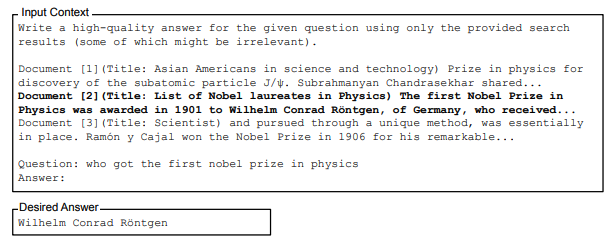

# Deep Generative Models – Final Project (BIU, 2025)
This repository contains the code for the final project of the `Deep Generative Models` course, taught by `Dr. Ethan Fetaya` at `Bar-Ilan University` (Isreal, 2025).

The project explores how `State Space Models` (SSMs) handle large-context inputs and compares their performance to `Large Language Models` (LLMs), building upon the findings from the `Lost in the Middle` paper (see full citation at the `References` section).

## 📋 Table of Contents:

- [Deep Generative Models – Final Project (BIU, 2025)](#deep-generative-models--final-project-biu-2025)
  - [Table of contents](#table-of-contents)
  - [State Space Model](#state-space-models)
  - [Experiment Data](#experiment-data)
  - [Experiment Description](#experiment-description)
  - [Evaluation](#evaluation)
  - [Experiment Setups](#experiment-setups)
  - [Results](#results)
  - [Future Work](#future-work)
  - [References](#references)

## 🔁 State Space Models

State Space Models (SSMs) are a class of sequence models that represent data using a hidden state that evolves over time. Unlike attention-based models that directly compare all token pairs, SSMs process sequences recursively and linearly in time, updating an internal state as they move forward token by token. This gives them strong modeling capabilities for long-range dependencies with efficient scaling.

<p align="center">
  
  <br/>
  <em>Block diagram representation of the linear state-space equations.<br>Source: Wikipedia.</em>
</p>

**Selective State Space:**

Selective SSMs introduce sparsity and gating mechanisms to improve efficiency and expressiveness. They selectively update or attend to parts of the sequence, making them better suited for large-scale language modeling.

<p align="center">
  
  <br/>
  <em>Selective State Space Model.<br>Source: "Mamba: Linear-Time Sequence Modeling with Selective State Spaces" paper.</em>
</p>

**Mamba Architecture**
Mamba is a recent architecture that uses a Selective State Space Model in place of the attention mechanism in Transformer blocks. It retains the overall structure of modern language models (LayerNorm, MLPs, residuals), but the attention layer is replaced with an SSM block. This makes Mamba a standard language model with SSMs instead of attention — enabling fast inference and efficient long-sequence processing.

<p align="center">
  
  <br/>
  <em>Mamba block diagram.<br>Source: "Mamba: Linear-Time Sequence Modeling with Selective State Spaces" paper.</em>
</p>

## 📄 Experiment Data

The original paper uses **NaturalQuestions-Open**, a dataset containing historical queries submitted to Google's search engine, paired with human-annotated answers from Wikipedia. Specifically, they selected 2,655 queries where the annotated long answer is in paragraph form rather than a list or table. For their experiments, they utilized passages from Wikipedia (chunks of up to 100 tokens) as documents within the input contexts.

For each query, the dataset includes one document that contains the correct answer and *k − 1* distractor documents.
* The answer document is a Wikipedia paragraph sourced from the NaturalQuestions annotations.
* The *k − 1* distractors are retrieved using a Contriever model fine-tuned on MS-MARCO. These are topically relevant Wikipedia chunks that do not include the answer.

The `lost-in-the-middle` team included the exact dataset used during experiments in their Git repository. This includes three folders containing 10, 20, and 30 document JSON files, with the following fields:

* *question (str):* the prompt's question (query).

* *answers (List[str]):* a list of short answers.

* *ctxs (List[Dict[str, Any]]):* a list of documents used for the prompt’s context.
  * Important fields: `title`, `text`, `hasanswer`, and `isgold`.
  * We used the `lost-in-the-middle` original `Document` object "as is" (see `common/entities.py `- `Document`).

* *nq_annotated_gold (Dict[str, Any]):* contains the original annotated answers data.
  * Important fields: full chunk with answer, long answers, short answers, etc.
  * The `answers` field used in the original paper corresponds to the `short answers` from the `nq_annotated_gold` field.

<p align="center">
  
  <br/>
  <em>Openbook prompt example.<br>Source: "Lost in the Middle: How Language Models Use Long Contexts" paper.</em>
</p>

## 🗣️ Experiment Description

Originally, the `lost-in-the-middle` paper examined two tasks: "multi-document question answering and key-value retrieval".
We focused on the "multi-document question answering" task and experimeneted two of its variants:

* **Gold Index Change:**

  In this variant we take a list of 10/20/30 documents, and change the location of the *gold* (correct) answer. For example, with 10 documents we examine the indicies of 0, 4 and 9. This experiment aims measure how the position of the correct answer affects the final output of the LLM.

* **Number of Documents Change:**

  In this variant, we fix the *gold* index (e.g., 0, 4, or 9) and vary the total number of documents: 10, 20, and 30. For example, if using gold index 0, we collect all document lists of sizes 10, 20, and 30 where the gold answer appears at index 0. Indices like 14 or 19 are excluded, as they don’t exist in the 10-document setting.

Each experiment includes data loading part, where we load the list of questions, documents, etc. (see `common/data.md`).<br>
When the data is ready, we process all the questions and documents into prompts using a `PromptBuilder` component (see `src/promptbuilder.py`).<br>Then, we're taking all the prompts and gets a model answer for each prompt-questions. We create a results object (see `common/data.md`) with the model answers and their evaluation results (see next section for evaluation overview).

> [!NOTE]
> We implemented each variant as a separate class (inheriting from a shared abstract base class for common functionality) and created a runner class that dynamically identifies the target experiment and executes it accordingly.
> 
> We used `vLLM` to manage LLM / SSM operations over GPU and HuggingFace `transformers` to dynamically add the model-specific instruction tokens to the prompt (when needed).
>
> We used `poetry` as a dependency manager and `pyest` to test our implementations. 
>

## 🧮 Evaluation

Our evaluation uses the `best_subspan_em` function from the original paper (see `src/metrics.py`).<br>
This function checks whether any of the ground truth answers can be found as a substring within the model's full answer.<br>
Both the model answer and the ground truth answers are normalized using `SQuAD` normalization before comparison.

> [!NOTE]
> This metric is useful for evaluating model responses because it checks if the correct answer appears anywhere within the full prediction, where the full prediction tends to be longer than the dataset `short answers`.
>


## 📦 Experiment Setups

1. We conducted both `Gold Index Change` and `Number of Documents Change` experiments for the following models:
  * Falcon3-Mamba-7B-Instruct
  * Llama-3.1-8B-Instruct

> [!NOTE]
> These experiments produced three sets of graphs for each model (with 10, 20, and 30 documents / 0, 4, and 9 gold indices), as well as an additional comparison graph for each test showing the performance differences between the LLM and the SSM.
>

2. We also ran a `Gold Index Change` experiment for the Falcon3-Mamba-7B-Base model.

> [!NOTE]
> In addition to generating the usual three sets of graphs (10, 20, and 30 documents), these results allowed us to compare the `Base` and `Instruct` versions of `Falcon3-Mamba-7B` and explore the effect of SSM instruction fine-tuning.
> 


## 🧠 Results

1. **Graphs for Falcon3-Mamba-7B-Instruct vs Llama-3.1-8B-Instruct:**

<p align="center">
  
</p>

  * From the graphs it is clear that the LLM outperform the SSM in all the experiments we ran.
  
  * A potential explanation can be the fact that the LLM is a bit larger (~800M params).
  
  * Another interesting finding is the fact SSM shows better performance when the gold index is the last index on the `Gold Index Change` experiment.
  
  * This behavior makes sense when considering the Mamba architecture. SSMs process input from left to right, so the most recent tokens (those closer to the end of the sequence) have more influence on the internal state of the model — with respect to the “present” time 𝑡. That means:
    * If the answer comes late, it’s closer to the prediction point, and the model can retain more signal from it.
    * Earlier gold documents may be “forgotten” or diminished due to the sequential nature of processing and the implicit decay of memory in SSMs.

> [!TIP]
> One practical takeaway from the above results: when using Mamba in context-intensive prompt scenarios—such as Retrieval-Augmented Generation (RAG)—**consider reversing the traditional chunk order**. That is, order your retrieved chunks so that the most relevant or similar result appears at the end of the prompt, where Mamba is more attentive.
>
> **⚠️ Pay Attention!**<br>The described behavior was observed with the *Instruct* model, but not with the *Base* model (as we'll show in the next section). That said, the *Base* model’s overall performance was generally poor. This suggests that instruction tuning plays a significant role in how well SSMs leverage long-context information **and making the above tip applicable specifically to the *Instruct* variant**.
>

2. **Graphs for Falcon3-Mamba-7B-Instruct vs Falcon3-Mamba-7B-Base:**

<p align="center">
  
</p>

* From the graphs, it's clear that the *Instruct* model consistently outperforms the *Base* model across all experiments we ran.

* Moreover, we included the *Instruct* model’s **closedbook** performance, and in most cases, **it outperforms the *Base* model's openbook** results — especially when the number of documents exceeds 10. In fact, in those larger-context settings, the Base model never surpassed the Instruct model’s closed-book performance.

* This directly supports our earlier point: **instruction fine-tuning significantly enhances the ability of SSMs to handle long-context prompts**.

## 🔮 Future Work

While our current experiments provide valuable insights into the behavior of State Space Models (SSMs) in comparison to Large Language Models (LLMs) for multi-document question answering, there are several directions for future research and development.

1. Exploring different State Space Models (SSMs) sizes.

2. Exploring (Transformers-SSMs) hybrid models.

3. Expand experiment and add the original paper KV-Retrival task.


## ⓒ References

This project builds upon the work presented in the paper *"Lost in the Middle: How Language Models Use Long Contexts"*. We extend this research by applying similar methodologies to State Space Models (SSMs), exploring how they manage large-context inputs in comparison to Large Language Models (LLMs).

Some portions of this code are based on the original implementation from *Lost in the Middle*, which is licensed under the MIT License. Additional contributions to this work have been made by Gal Sarid (2025).

For more details on the original study, see:

```
@misc{liu-etal:2023:arxiv,
  author    = {Nelson F. Liu  and  Kevin Lin  and  John Hewitt  and Ashwin Paranjape  and Michele Bevilacqua  and  Fabio Petroni  and  Percy Liang},
  title     = {Lost in the Middle: How Language Models Use Long Contexts},
  note      = {arXiv:2307.03172},
  year      = {2023}
}
```

We also relied on the foundational Mamba paper:

```
@article{mamba,
  title={Mamba: Linear-Time Sequence Modeling with Selective State Spaces},
  author={Gu, Albert and Dao, Tri},
  journal={arXiv preprint arXiv:2312.00752},
  year={2023}
}
```

We also found [this blog post](https://huggingface.co/blog/lbourdois/get-on-the-ssm-train) — "Introduction to State Space Models (SSM)" by Loïck Bourdois — helpful in understanding the foundations of SSMs.